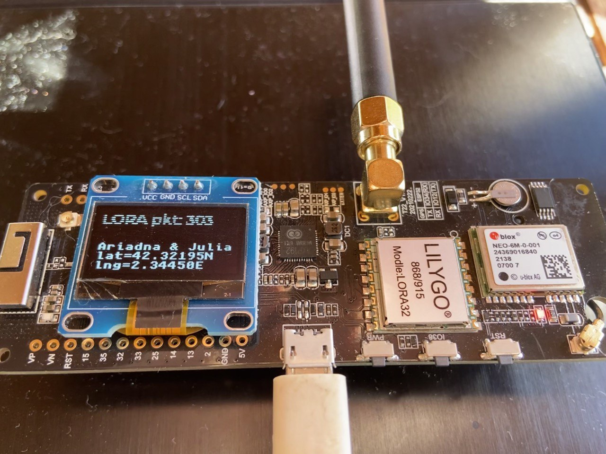

# Kids LoRaWAN GPS [WIP]

⚠ THIS PROJECT IS WIP ⚠


(some screen top lines are not working 😞)

## Introduction

- This project aims to be a playground to learn [ESP32](http://esp32.net/) + [Espressif](https://www.espressif.com/en) technology during the summer :)
- The idea is to use an ESP32 kit with LoRa + GPS + battery capabilities that will send the GPS coordinates through LoRa. Then we will receive these coordinates with another ESP32 device with LoRa capabilities.


## System

### Hardware
- Transmitter:
  - [LILYGO TTGO T-Beam V1.1 ESP32](http://www.lilygo.cn/prod_view.aspx?TypeId=50060&Id=1317&FId=t3:50060:3)
- Receiver:
  - Any ESP32 with LoRaWAN capabilities:
    - Heltec WiFi Kit 32 + Lora SX1278

### Software
- IDE: [CLion](https://www.jetbrains.com/clion/)
- Framework: [Espressif](https://www.espressif.com/en)


## Work done

### Features working
- [x] GPS
- [x] Screen SSD1306 
- [x] LoRa
- [ ] Battery

### Tasks done
- [x] Get GPS position
- [x] Show GPS position in screen 
- [x] Send GPS position via LoRa
- [x] Show sending position via LoRa in screen
- [ ] Show battery status


## How to build and flash

- First, you will need to set up the Espressif environment. You can follow the [Get Started](https://docs.espressif.com/projects/esp-idf/en/v4.4.2/esp32/get-started/index.html).

### Transmitter
- Connect your device to the USB port.
  ```
  cd kids_lora_gps_tx
  idf.py -p /dev/ttyACM0 flash monitor
  ```

#### Configuration
- Default configuration will work for LILYGO TTGO T-Beam V1.1 ESP32 but you can use another device. In that case, you should do a `idf.py menuconfig` and configure:
  - NMEA parser / UART RXD pin number
  - Component config / LoRa Configuration
  - Component config / LVGL configuration
  - Component config / LVGL TFT Display controller


### Receiver
- Connect your device to the USB port.
  ```
  cd kids_lora_gps_rx
  idf.py -p /dev/ttyACM0 flash monitor
  ```

#### Configuration
- Default configuration will work for LILYGO TTGO T-Beam V1.1 ESP32 but you can use another device. In that case, you should do a `idf.py menuconfig` and configure:
  - Component config / LoRa Configuration
  - Component config / LVGL configuration
  - Component config / LVGL TFT Display controller


## Tests

- It is just a trial to test a component to learn how it works. Do not expect to see a lot of tests ;)

### Unit test (Linux host)
- No need for any device.
  ```
  cd components/gps/gps_cbor_coders/test/host_test
  idf.py build
  ./build/test_host_gps_cbor_coders.elf
  ```

### Unit test (Target)
- Connect your device to the USB port.
  ```
  cd components/gps/gps_cbor_coders/test/target_test
  idf.py -p /dev/ttyACM0 flash monitor
  ```

## Lessons learnt
- Devices:
  - [x] ESP32 + Espressif framework
  - [x] GPS NEO-6M 
  - [x] Screen monochrome OLED SSD1306
  - [x] LoRa module
  - [ ] Batter power management IC AXP192
- Development environment, tools and frameworks:
  - [x] Espressif
    - [x] Application Level Tracing 
    - [x] Build System (components, Kconfig...)
    - [x] Error Handling
    - [x] Core Dump
    - [x] Event Handling
    - [x] Fatal Errors
    - [ ] JTAG Debugging
    - [x] Unit test (Linux host = run in Linux)
    - [x] Unit test (target = run in ESP32 device)
    - [ ] Wi-Fi + Provisioning
    - [ ] HTTP Server
    - [ ] Watchdogs
  - [x] CLion
  - [x] CMake
  - [x] Cbor
  - [x] FreeRTOS
- Other learnings using examples:
  - [x] OTA
  - [x] AWS IoT
  - [ ] Steppers
